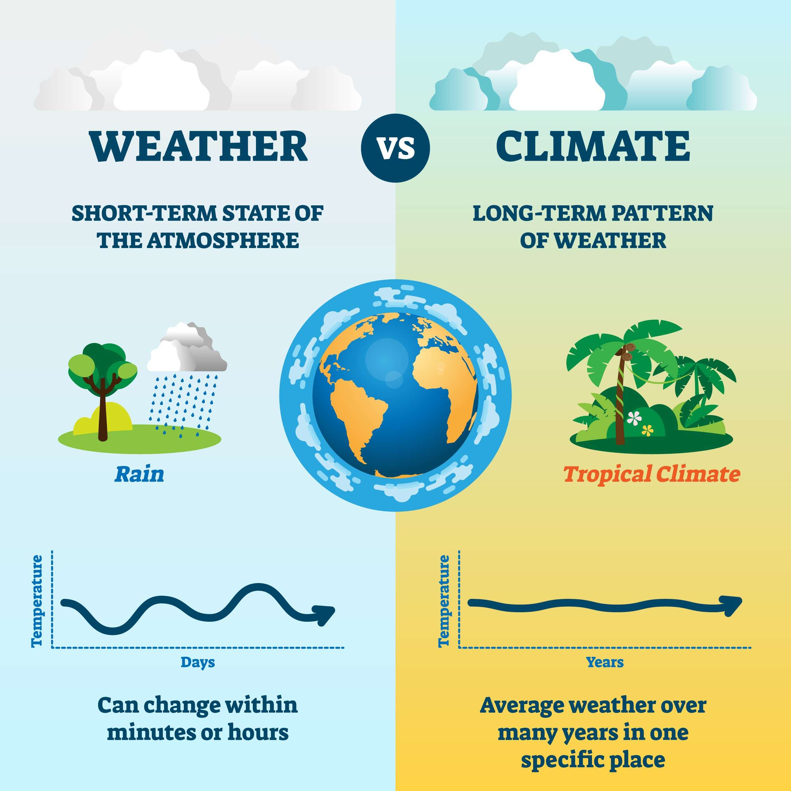
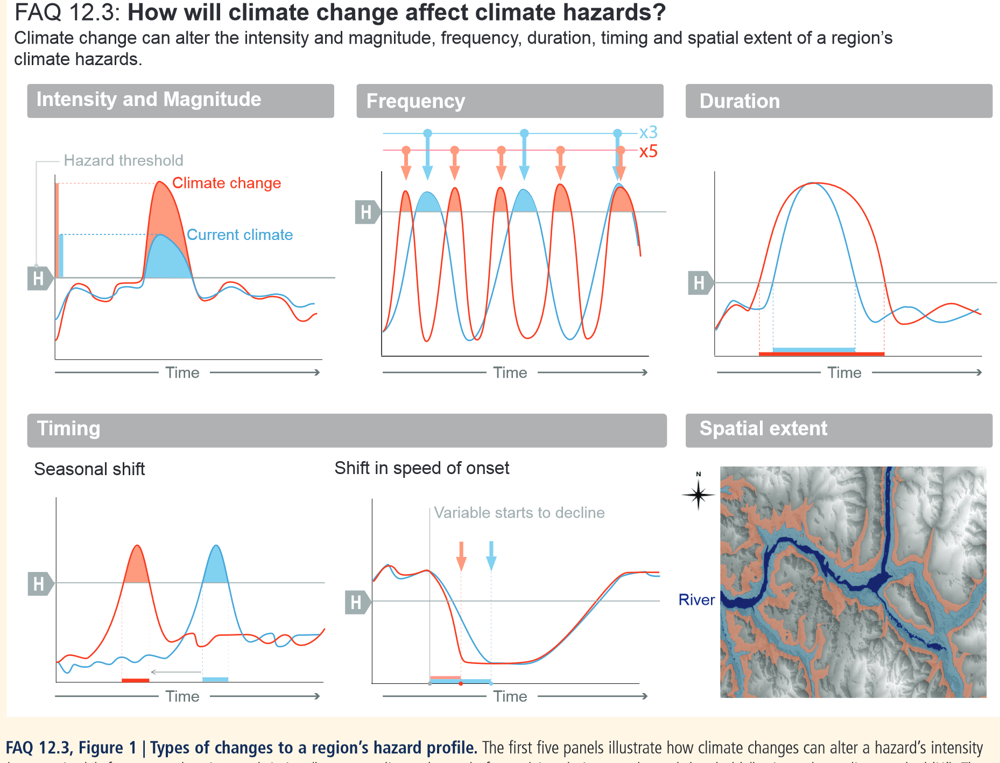

- [ ] Recheck article: Impacts of Weather and Climate Extremes

> **Summary**
>
> - 🌊 **Physical damage:** floods, erosion and habitat loss reshape landscapes.
> - 💸 **Economic cost:** buildings, crops and infrastructure suffer billion‑dollar losses.
> - 🏥 **Health & society:** displacement, disease, stress and unequal burdens.
> - 🔁 **Compound risks:** drought‑wildfire‑storm cascades amplify harm.
> - 🛠️ **Adaptation:** resilience requires planning, equity and ecosystem restoration.
>
> The following sections explore these themes in greater detail with illustrative figures.

Weather and climate extremes - such as floods, heatwaves, droughts, hurricanes and wildfires - leave a measurable footprint on the natural world and human societies. Their occurrence is increasing in many regions as the climate warms, raising concerns about long‑term resilience and sustainability. This article reviews the principal categories of impact, providing concrete examples and highlighting the interconnected nature of physical, economic, and social effects.

## 1. Physical and Environmental Impacts

*Figure 1 – erosion along a coastline following a major storm.*

The most immediate consequences of extreme events are seen in the environment. Heavy
precipitation and storm surges can erode coastlines and riverbanks, reshape landscapes, and
transport large quantities of sediment and pollutants. Flash floods carve new channels and
undermine infrastructure, while prolonged droughts reduce river flow and degrade soils.

Heatwaves stress terrestrial and aquatic ecosystems; for example, the 2019 European heatwave
caused widespread tree mortality and coral bleaching in the Mediterranean. Wildfires, fueled by
dry conditions and high temperatures, consume vegetation, degrade air quality, and contribute to
greenhouse‑gas emissions. The 2020 wildfire season in Australia burned over 10 million hectares,
displacing native fauna and altering habitats for years.

## 2. Economic Consequences

*Figure 2 – post‑disaster scene illustrating economic loss and clean‑up costs.*

Extreme weather events translate directly into economic losses. Damage to buildings, roads,
power lines, and agricultural fields requires costly repairs and reconstruction. The annual global
bill from storms alone exceeds hundreds of billions of dollars. In 2021, Hurricane Ida inflicted an
estimated US $75 billion in damages across the United States.

Agriculture is especially vulnerable: droughts reduce crop yields, heatwaves can spoil
harvests, and floods may destroy farmland. These losses ripple through supply chains, leading to
higher food prices and affecting food security. The insurance industry is also strained; premiums
rise and some regions become uninsurable, shifting costs to governments and individuals.

Energy systems face dual pressures. Heatwaves increase electricity demand for cooling, while
droughts reduce hydropower generation and limit cooling water for thermal plants. Storms can
knock out transmission lines, causing blackouts with significant economic ramifications.

## 3. Societal and Health Effects

*Figure 3 – communities navigating flooded neighborhoods after a storm.*

Human communities experience profound social and health impacts. Flooding displaces residents,
damages homes, and contaminates drinking water supplies, leading to outbreaks of waterborne
diseases. Heatwaves are a silent killer: during the 2003 European heatwave, roughly 70 000 excess
deaths were recorded, disproportionately affecting the elderly and socially isolated.

Mental health consequences are common after disasters. Survivors of hurricanes and wildfires
report increased rates of anxiety, depression, and post‑traumatic stress disorder. The disruption
of schools and workplaces compounds stress, and rebuilding can take years, prolonging recovery.

Marginalized and low‑income populations tend to bear the brunt of these impacts. They often live
in hazard‑prone areas, have fewer resources to evacuate or rebuild, and may lack access to
insurance. This uneven burden raises equity concerns and highlights the need for targeted
adaptation measures.

## 4. Compound and Cascading Impacts

Impacts do not occur in isolation. For instance, a drought can weaken vegetation, making an
area more susceptible to wildfires; a wildfire can then degrade air quality hundreds of
kilometers away, affecting respiratory health. Infrastructure failures during storms can impair
emergency response and supply chains, leading to food and fuel shortages.

Climate change is amplifying the frequency and intensity of many extremes, increasing the
likelihood of compound events. Planning and risk assessment must therefore consider multiple
hazards and their interactions rather than treating each event independently.

## 5. Adaptation and Resilience

Understanding impact pathways helps design better adaptation strategies. Building flood‑resilient
infrastructure, preserving wetlands that absorb storm surge, and implementing early warning
systems save lives and reduce damages. Urban planning that increases green spaces and
reflective surfaces can moderate heat‑island effects. Supporting diversified livelihoods and
social safety nets enhances community resilience to economic shocks.

Investments in restoration—replanting forests after fires, rehabilitating degraded soils, and
reconnecting rivers to floodplains—can also mitigate future impacts. Equitable access to
information and resources ensures that vulnerable groups are included in adaptation efforts.

## Conclusion

Weather and climate extremes impose a wide spectrum of impacts that transcend environmental
damage to affect economies, health, and social well‑being. As the climate continues to change,
proactive planning, robust infrastructure, and social equity must guide responses to these
challenges. Documenting and communicating impact case studies remains essential for
informed decision‑making and for fostering a more resilient future.

<!-- word count ≈ 780 -->